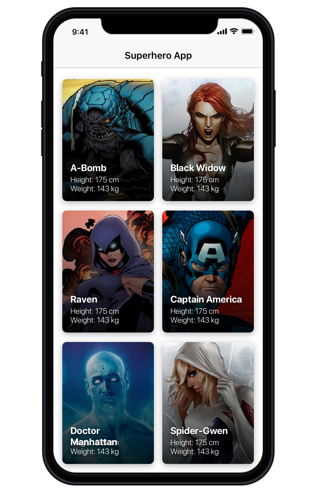

# Photo Grid Exercise #

## Objetive ##

* evaluate basic programming concepts
* evaluate javascript and react native knowledge 
* evaluate management of external libraries ~ specifically: Redux and api client
* evaluate basic terminal and git skills
* evaluate handling queries to an api
* evaluate front-end skills
* object handling

## Instalation Guide ##

##### 1. Setup config

- Install [Node & NPM](https://nodejs.org/en/download/)
- Install [Git](https://git-scm.com/) 


##### 2. Clone repository

```
git clone https://tmakdconsultr@bitbucket.org/consultr/evaluations.git
```

##### 3.  Installation
Enter the project folder from a terminal, and run:

```bash
sudo sh install.sh
```


##### 2'. Manual Installation

```
sudo npm install -g expo-cli;
```

```
npm install;
```


##### 3. Run Project

```
expo start;
```

Then run the project on the Simulator

## Requirements ##

Starting from the base of the /src code it is requested:

- Have an ios / android simulator (preferred ios)
 
 - Build a 2-grid of photos from a collection of superheroes as reference using REDUX as a structure.


 Notes:
  - External libraries can be used
  - Code quality is valued
  
 ## API ##
 
 Github Repo:
 https://akabab.github.io/superhero-api/api/
 
 For the API we are going to consume the [akabab]( https://akabab.github.io/) api from Super heroes.
 
 It has a lot of data about all the superheroes that exist. 
 
 >It's like 600 records.!
 
 
 But in this exercise we are going to use only the endpoint that ALL superheroes bring, to use the data we need.
 
 Each super hero has many images (xs-xm-md-xl). Let's use xs for the thumbnail and xl for the fullscreen
  
 ##### ENDPOINT
 https://cdn.rawgit.com/akabab/superhero-api/0.2.0/api/all.json
 
 
 ---

 ### Reference
 https://invis.io/M8WXIZZE7PV
 
 
 
## Q&A ##

Doubts of statement?
>Write me by slack or by email (preferably slack)

Technical questions?
>option A: Google!, option B: slack me!


